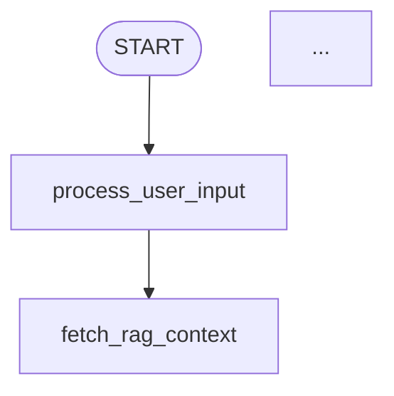

# LangGraph Debug Scripts

This directory contains standalone debugging and testing scripts for the LangGraph conversation system. These scripts can be run independently of the main backend application, making it easy to test, debug, and visualize the graph.

## 🎯 Quick Start

```bash
# Navigate to backend directory
cd backend

# Run any debug script
pnpm debug:graph:validate
pnpm debug:graph:compile
pnpm debug:graph:invoke
pnpm debug:graph:stream
pnpm debug:graph:proactive
pnpm debug:graph:visualize
pnpm debug:graph:all          # Run all scripts
```

## 📋 Available Scripts

### 1. `debug-compile.ts` - Compile & Verify Graph

Compiles the conversation graph and outputs diagnostic information.

**Usage:**
```bash
pnpm debug:graph:compile

# Or directly with ts-node
ts-node -r tsconfig-paths/register src/services/langgraph/scripts/debug-compile.ts
```

**What it does:**
- ✅ Builds the graph structure
- ✅ Lists all nodes
- ✅ Displays graph flow
- ✅ Verifies configuration
- ✅ Tests checkpointer initialization

**Output:**
```
🐛 LangGraph Debug: Compilation Test
━━━━━━━━━━━━━━━━━━━━━━━━━━━━━━━━━━━━━━━━━━━━━━━━━━━━━━━━━━
📦 Step 1: Building graph structure...
✅ Graph built successfully!
...
✅ COMPILATION SUCCESSFUL!
```

---

### 2. `test-invoke.ts` - Test Graph Invocation

Tests the graph by invoking it with sample user inputs.

**Usage:**
```bash
# Default test message
pnpm debug:graph:invoke

# Custom session and message
pnpm debug:graph:invoke -- --session-id my-test-session --message "Hello, how are you?"

# Show full state output
pnpm debug:graph:invoke -- --full
```

**What it does:**
- ✅ Invokes graph with test input
- ✅ Displays timing information
- ✅ Shows AI response
- ✅ Displays emotion/sentiment analysis
- ✅ Shows goal progress
- ✅ Lists conversation history

**Output:**
```
🧪 LangGraph Test: Invoke Graph
━━━━━━━━━━━━━━━━━━━━━━━━━━━━━━━━━━━━━━━━━━━━━━━━━━━━━━━━━━
📥 Test Input:
  Session ID: test-session-1234567890
  User ID: test-user-123
  User Message: "Hi, I need help with..."
...
✅ TEST PASSED!
```

---

### 3. `test-stream.ts` - Test Streaming Execution

Tests the graph by streaming its execution, showing each node's output in real-time.

**Usage:**
```bash
# Default test
pnpm debug:graph:stream

# Custom session and message
pnpm debug:graph:stream -- --session-id my-stream-test --message "Tell me about yourself"
```

**What it does:**
- ✅ Streams graph execution
- ✅ Shows each node's updates
- ✅ Displays timing per chunk
- ✅ Shows final aggregated result
- ✅ Demonstrates real-time processing

**Output:**
```
🧪 LangGraph Test: Stream Graph Execution
━━━━━━━━━━━━━━━━━━━━━━━━━━━━━━━━━━━━━━━━━━━━━━━━━━━━━━━━━━
⚙️  Streaming graph execution...

📦 Chunk 1: process_user_input
  └─ [process_user_input]
     User: "Can you give me tips for..."
  ──────────────────────────────────
...
✅ STREAM TEST PASSED!
```

---

### 4. `test-proactive.ts` - Test Proactive Messages

Tests the proactive message generation capabilities (start, inactivity, follow-up, backchannel).

**Usage:**
```bash
# Test start message (default)
pnpm debug:graph:proactive

# Test specific proactive type
pnpm debug:graph:proactive -- --type start
pnpm debug:graph:proactive -- --type inactivity
pnpm debug:graph:proactive -- --type followup
pnpm debug:graph:proactive -- --type backchannel
```

**Proactive Types:**
- `start` - Initial greeting when conversation begins
- `inactivity` - Nudge after user silence
- `followup` - Continue the conversation
- `backchannel` - Acknowledgment or brief response

**What it does:**
- ✅ Tests proactive message generation
- ✅ Establishes context (for inactivity/followup/backchannel)
- ✅ Generates type-appropriate message
- ✅ Displays emotion/sentiment analysis
- ✅ Shows metadata and timing

**Output:**
```
🧪 LangGraph Test: Proactive Messages
━━━━━━━━━━━━━━━━━━━━━━━━━━━━━━━━━━━━━━━━━━━━━━━━━━━━━━━━━━
⚙️  Test Configuration:
  Proactive Type: start
...
💬 Proactive Message:
  ┌──────────────────────────────────────────────────────────┐
  │ Hello! I'm excited to help you prepare for your         │
  │ interview. What role are you interviewing for?          │
  └──────────────────────────────────────────────────────────┘
✅ PROACTIVE TEST PASSED!
```

---

### 5. `visualize-graph.ts` - Visualize Graph Structure

Generates a visual representation of the graph structure.

**Usage:**
```bash
# Text format (default)
pnpm debug:graph:visualize

# Mermaid diagram format
pnpm debug:graph:visualize -- --format mermaid
```

**Output Formats:**
- `text` - ASCII art diagram in console
- `mermaid` - Mermaid diagram code (paste into [mermaid.live](https://mermaid.live))

**What it does:**
- ✅ Shows complete graph flow
- ✅ Lists all nodes with descriptions
- ✅ Displays conditional routing
- ✅ Generates copyable Mermaid code

**Text Output:**
```
🔍 LangGraph Structure Visualization (Text Format)
━━━━━━━━━━━━━━━━━━━━━━━━━━━━━━━━━━━━━━━━━━━━━━━━━━━━━━━━━━
📊 Graph Flow:
  START
    ↓
  ┌─────────────────────────────────────────────────────────┐
  │ process_user_input                                      │
  │ • Loads session and user data                           │
  └─────────────────────────────────────────────────────────┘
...
```

**Mermaid Output:**


---

### 6. `validate-structure.ts` - Validate Graph Structure

Validates the LangGraph structure without requiring database or external dependencies.

**Usage:**
```bash
pnpm debug:graph:validate
```

**What it does:**
- Checks graph node definitions and edges
- Validates conditional routing logic
- Reports structural issues without needing a running database

---

### 7. `test-standalone.ts` - Test Standalone Server

Tests the standalone LangGraph server end-to-end.

**Usage:**
```bash
pnpm langgraph:test
```

**What it does:**
- Starts the standalone server on port 8123
- Tests health endpoint, session creation, conversation flow
- Validates the full request/response cycle

---

### 8. `run-all-tests.sh` - Run All Debug Scripts

Bash script that runs all debug scripts in sequence.

**Usage:**
```bash
pnpm debug:graph:all
```

---

## 🔧 Prerequisites

Before running these scripts, ensure:

1. **Environment Variables Set** (`.env` file in `backend/`):
   ```bash
   # Required
   DATABASE_URL=postgresql://...
   OPENAI_API_KEY=sk-...
   
   # Optional (for external services)
   RAG_SERVICE_URL=http://localhost:8001
   TRANSFORMERS_SERVICE_URL=http://localhost:8002
   
   # Optional (for LangSmith tracing)
   LANGCHAIN_TRACING_V2=true
   LANGCHAIN_API_KEY=ls_...
   LANGCHAIN_PROJECT=careersim-dev
   ```

2. **Database Running** (for full tests):
   ```bash
   docker compose -f docker-compose.local.yml up -d postgres
   ```

3. **Dependencies Installed**:
   ```bash
   pnpm install
   ```

## 🎨 Common Use Cases

### Case 1: Quick Verification
```bash
# Just verify the graph compiles
pnpm debug:graph:compile
```

### Case 2: Test Basic Conversation
```bash
# Test a simple conversation
pnpm debug:graph:invoke -- --message "Hello, I need interview help"
```

### Case 3: Debug Streaming
```bash
# See step-by-step execution
pnpm debug:graph:stream
```

### Case 4: Test Proactive Features
```bash
# Test all proactive types
pnpm debug:graph:proactive -- --type start
pnpm debug:graph:proactive -- --type inactivity
pnpm debug:graph:proactive -- --type followup
pnpm debug:graph:proactive -- --type backchannel
```

### Case 5: Generate Documentation
```bash
# Get Mermaid diagram for docs
pnpm debug:graph:visualize -- --format mermaid > graph.mmd
```

## 🐛 Debugging Tips

### Issue: Compilation Fails
```bash
# Check configuration
pnpm debug:graph:compile

# Look for:
# - Missing environment variables
# - Database connection issues
# - Missing dependencies
```

### Issue: Graph Hangs During Execution
```bash
# Disable LangSmith tracing (can cause hangs)
export LANGCHAIN_TRACING_V2=false

# Run test again
pnpm debug:graph:invoke
```

### Issue: External Services Not Available
The scripts will attempt to call external services (RAG, Transformers) but should gracefully handle failures. Check:
- RAG service: `curl http://localhost:8001/health`
- Transformers: `curl http://localhost:8002/health`

### Issue: Database Connection Failed
```bash
# Start local database
docker compose -f docker-compose.local.yml up -d postgres

# Verify connection
psql $DATABASE_URL -c "SELECT 1"
```

## 📊 Interpreting Results

### Successful Compilation
```
✅ COMPILATION SUCCESSFUL!
```
Graph is ready to use!

### Successful Invocation
```
✅ TEST PASSED!
Duration: 1234ms
```
Graph executed without errors.

### Node Execution Times
- `process_user_input`: ~50-100ms (DB query)
- `fetch_rag_context`: ~200-500ms (RAG service call)
- `generate_ai_response`: ~1000-3000ms (OpenAI API)
- `analyze_response`: ~200-500ms (Transformers service)
- `evaluate_goals`: ~500-1500ms (Tool calls)
- `persist_and_emit`: ~50-100ms (DB write)

### Goal Progress
- `not_started`: Goal hasn't been addressed yet
- `in_progress`: Goal is partially achieved
- `achieved`: Goal fully met (confidence > 0.8)

## 🔗 Integration Testing

To test the graph integrated with the full backend:

1. Start backend with LangGraph enabled:
   ```bash
   USE_LANGGRAPH=true pnpm dev
   ```

2. Make API request:
   ```bash
   curl -X POST http://localhost:5001/api/simulations/sessions/SESSION_ID/messages \
     -H "Content-Type: application/json" \
     -d '{"content": "Hello, I need help"}'
   ```

3. Check LangSmith dashboard for traces

## 📚 Next Steps

1. ✅ Verify compilation with `debug-compile.ts`
2. ✅ Test basic invocation with `test-invoke.ts`
3. ✅ Test streaming with `test-stream.ts`
4. ✅ Test proactive messages with `test-proactive.ts`
5. ✅ Generate documentation with `visualize-graph.ts`
6. 🔄 Integrate into routes (see main README)
7. 🚀 Deploy to production

## 🆘 Support

If you encounter issues:
1. Check environment variables
2. Verify external services are running
3. Review logs in console output
4. Enable LangSmith tracing for detailed traces
5. Check the main README at `backend/src/services/langgraph/README.md`

---

Happy debugging!

---

## License

This project is licensed under the MIT License -- see the [LICENSE.md](../../../../../LICENSE.md) file for details.

## Author

Pavel Vdovenko ([reactivecake@gmail.com](mailto:reactivecake@gmail.com))
